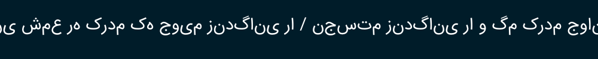
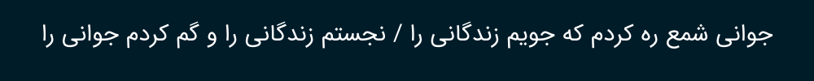

# Go Persian Text Processing Tool
The Go Persian Text package provides a set of functions for normalizing Persian (Farsi) strings, making them suitable for graphical text rendering in libraries like `fogleman/gg` or `golang.org/x/image/font`.

Before Reshape :



After Reshape :


## Functions
1. ReShape
2. IsPersianLetter
3. IsPersian
4. ToPersianDigits
5. ToEnglishDigits

## Usage
```bash
go get github.com/poagz/go-persian-text
```
To ReShape :
```
import (
	"github.com/poagz/go-persian-text/persian"
	"golang.org/x/image/font"
	"golang.org/x/image/font/opentype"
	"golang.org/x/image/math/fixed"
	"image"
	"image/color"
	"image/draw"
	"image/png"
	"os"
)
```
```
img := image.NewRGBA(image.Rect(0, 0, 1000, 100))
draw.Draw(img, img.Bounds(), image.NewUniform(color.RGBA{R: 0, G: 28, B: 41, A: 255}), image.Point{}, draw.Over)

fontFile, _ := os.ReadFile("font.ttf")
fontData, _ := opentype.Parse(fontFile)
fontFace, _ := opentype.NewFace(fontData, &opentype.FaceOptions{
Size:    26,
DPI:     80,
Hinting: font.HintingNone,
})

d := &font.Drawer{
Dst:  img,
Src:  image.NewUniform(color.White),
Face: fontFace,
}

label := persian.ReShape("جوانی شمع ره کردم که جویم زندگانی را / نجستم زندگانی را و گم کردم جوانی را")

labelWidth := d.MeasureString(label).Round()
d.Dot = fixed.P((img.Bounds().Dx()-labelWidth)/2, img.Bounds().Dy()/2)

d.DrawString(label)

outputFile, _ := os.Create("output.png")
defer outputFile.Close()
png.Encode(outputFile, img)
```